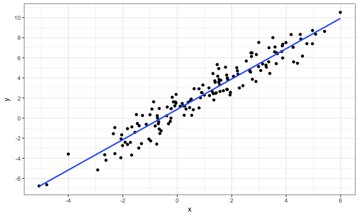
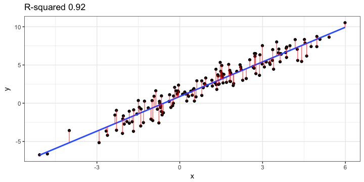
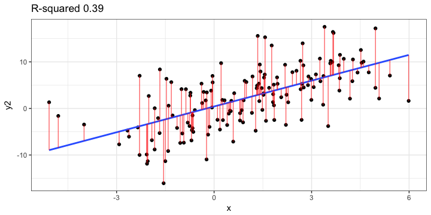
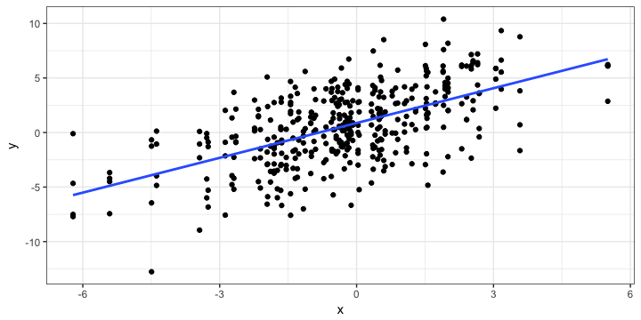
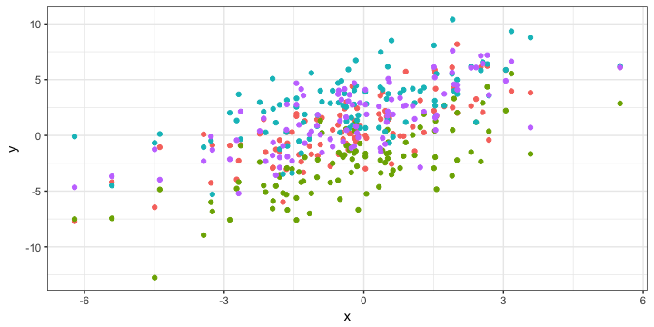
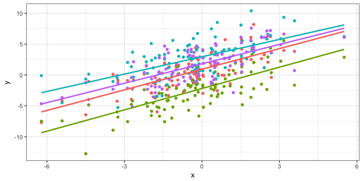
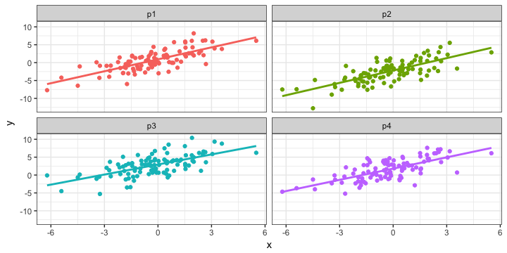
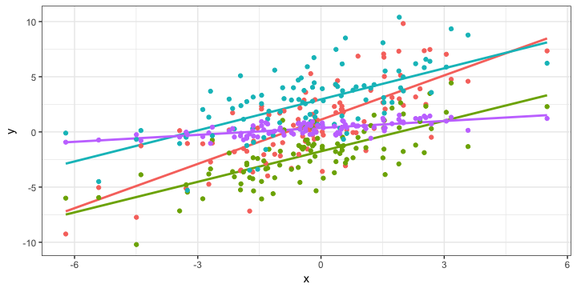
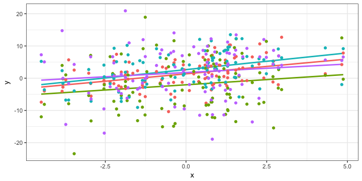

# LMER workshop Session 2
Justin Sulik & Louis ten Bosch  
justin.sulik@gmail.com  
github/justinsulik  
October 19, 2017  


## An introduction to LMERs

- Learning outcomes:
    - Understand the difference between fixed and random effects
    - Understand why we bother modeling random effects 
    - Use the `lmer()` function to create a simple model
    - Understand main elements of the `lmer()` output
    
## An introduction to LMERs

- The approach today:
    - "Simulate and see"
    - I'm skipping a bunch of stuff you *should* usually do:
        - Looking at how the data/errors are distributed, 
        - Looking for outliers
        - etc.

## Set up


```r
library(tidyverse)
library(lme4)
library(MuMIn)
```

## Regression


- $y = \beta_0 + \beta_1*x + \epsilon$

> - $y = \beta_0 + \beta_1*x_1 + \beta_2*x_2 + \dots + \epsilon$

> - $y = 0.88 + 1.51x$



<div class="notes">
talk through graph. 
y-hat
</div>

## Unexplained variance



<div class="notes">
error vs residuals
</div>

## Unexplained variance



> - Let's check understanding:
> - Is the effect weaker?
> - Has the correlation changed?
> - Why are larger residuals a problem?

<div class="notes">
weaker? no, could be a bit weaker, a bit stronger. more room to vary. 
error: less explanation
might not be significant
process might be noisy
OR might be missing another important variable
</div>   

## Simulate and see

Change some of the values to see what happens 

(e.g. change the sd of the error to make it more spread out)


```r
x <- rnorm(150,0,2) #N, mean, sd
e <- rnorm(150,0,1) #N, mean, sd 
y <- 1 + 2*x + e #So what is the expected intercept? Slope?
data <- data.frame(x=x,y=y)

mod.lm <- lm(y~x,data)
coef(mod.lm)

data %>% select(x,y) %>% cor
summary(mod.lm)$r.squared
```

## Reducing unexplained variance

- $y = \beta_0 + \beta_1*x + \epsilon$
- $\epsilon$ is unexplained random error
- It's a big amorphous bag of stuff we don't know
- What if there was still some random variation, but we could 
    - model it?
    - improve $R^2$?

## Reducing unexplained variance

- Imaginary experiment:
    - How quickly do people learn to recognize unfamiliar words in a foreign language over multiple practice sessions?
    - https://www.youtube.com/watch?v=julUUzo4NX4
    - Dependent: #identified, ...
    - Independent: #practice sessions, ... 
    
>   - Do you expect the effect to be the same for everyone?
>   - If not, how might participants differ?
>   - Do we care if participant A is better than participant B at this task?
>   - Why get each participant to respond more than once?
    
<div class="notes">
kodomo, soshite
hit/no hit
count of hits within X time
sentence length, position in sentence, frequency, 
within-subj: reduces # participants (reduces couple sources of error! pool of variation, and chance that assignment to condition introduces an effect)
</div>

## Reducing unexplained variance

- $y = \beta_0 + \beta_1*time + \epsilon$

> - $y = \beta_0 + \beta_1*time + (1|participant) + \epsilon$
> - $y = \beta_0 + \beta_1*time + (1|word) + \epsilon$
> - $y = \beta_0 + \beta_1*time + (1|word) + (1|participant) + \epsilon$

> - The random effects give some structure to the error
> - We still don't understand the random effects
> - We don't _control_ them
> - They are specific to this data

<div class="notes">
general error term
</div>

## Simulate and see {.smaller}


```r
x <- rnorm(100,0,2)
e1 <- rnorm(100,1,2)
e2 <- rnorm(100,-2,2)
e3 <- rnorm(100,3,2)
e4 <- rnorm(100,2,2)
data <- data.frame(x=x,p1=x+e1,p2=x+e2,p3=x+e3,p4=x+e4)
summary(data)
```

```
##        x                 p1                p2                 p3        
##  Min.   :-6.2141   Min.   :-7.7094   Min.   :-12.7623   Min.   :-5.288  
##  1st Qu.:-1.4460   1st Qu.:-0.9794   1st Qu.: -4.5096   1st Qu.: 0.797  
##  Median :-0.2282   Median : 0.2943   Median : -2.2218   Median : 2.802  
##  Mean   :-0.2463   Mean   : 0.6515   Mean   : -2.4814   Mean   : 2.720  
##  3rd Qu.: 0.9383   3rd Qu.: 2.2034   3rd Qu.: -0.8633   3rd Qu.: 4.212  
##  Max.   : 5.5042   Max.   : 8.1839   Max.   :  5.5403   Max.   :10.395  
##        p4         
##  Min.   :-5.2029  
##  1st Qu.:-0.6453  
##  Median : 1.6120  
##  Mean   : 1.5463  
##  3rd Qu.: 3.6607  
##  Max.   : 7.6017
```

```r
dataLong <- data %>% gather(participant,y,p1:p4)
```

## Simulate and see


```r
ggplot(dataLong,aes(x=x,y=y))+
  geom_point()+
  stat_smooth(method=lm,se=F)+
  theme_bw()
```



## Simulate and see 


```r
ggplot(dataLong,aes(x=x,y=y,color=participant))+
  geom_point()+
  theme_bw()+
  guides(color=F)
```



## Simulate and see 


```r
ggplot(dataLong,aes(x=x,y=y,color=participant))+
  geom_point()+
  stat_smooth(method=lm,se=F)+
  theme_bw()+
  guides(color=F)
```



## Simulate and see


```r
ggplot(dataLong, aes(x=x,y=y,color=participant))+
  geom_point()+
  stat_smooth(method=lm,se=F)+
  theme_bw()+
  facet_wrap(~participant)+
  guides(color=F)
```



## lm() {.smaller}


```r
mod.lm <- lm(y~x,dataLong)
summary(mod.lm)
```

```
## 
## Call:
## lm(formula = y ~ x, data = dataLong)
## 
## Residuals:
##     Min      1Q  Median      3Q     Max 
## -8.8548 -1.8971  0.0444  2.0519  7.4975 
## 
## Coefficients:
##             Estimate Std. Error t value Pr(>|t|)    
## (Intercept)  0.87092    0.14303   6.089 2.68e-09 ***
## x            1.06334    0.07323  14.521  < 2e-16 ***
## ---
## Signif. codes:  0 '***' 0.001 '**' 0.01 '*' 0.05 '.' 0.1 ' ' 1
## 
## Residual standard error: 2.838 on 398 degrees of freedom
## Multiple R-squared:  0.3463,	Adjusted R-squared:  0.3447 
## F-statistic: 210.9 on 1 and 398 DF,  p-value: < 2.2e-16
```

## lmer() with random intercept {.smaller}


```r
mod.lmer <- lmer(y~x+(1|participant),dataLong)
summary(mod.lmer)
```

```
## Linear mixed model fit by REML ['lmerMod']
## Formula: y ~ x + (1 | participant)
##    Data: dataLong
## 
## REML criterion at convergence: 1741.7
## 
## Scaled residuals: 
##      Min       1Q   Median       3Q      Max 
## -2.85729 -0.68698  0.01418  0.70703  2.59308 
## 
## Random effects:
##  Groups      Name        Variance Std.Dev.
##  participant (Intercept) 4.918    2.218   
##  Residual                4.345    2.085   
## Number of obs: 400, groups:  participant, 4
## 
## Fixed effects:
##             Estimate Std. Error t value
## (Intercept)  0.87092    1.11385   0.782
## x            1.06334    0.05379  19.768
## 
## Correlation of Fixed Effects:
##   (Intr)
## x 0.012
```

## lmer() with random intercept


```r
ranef(mod.lmer)
```

```
## $participant
##    (Intercept)
## p1  0.04210354
## p2 -3.06335190
## p3  2.09212182
## p4  0.92912654
```

## lmer() with random intercept {.smaller}


```r
r.squaredGLMM(mod.lm)
```

```
##       R2m       R2c 
## 0.3457558 0.3457558
```

```r
r.squaredGLMM(mod.lmer)
```

```
##       R2m       R2c 
## 0.3147831 0.6785860
```

```r
# Residual variance 
summary(mod.lm)$sigma^2 # Is this anywhere in the model summary? 
```

```
## [1] 8.052754
```

```r
summary(mod.lmer)$sigma^2 #Where in the model summary is this value found?
```

```
## [1] 4.345376
```

<div class="notes">
So what is `lmer()` modeling (in relation to the random intercepts)?
</div>

## Simulate and see

Try change one of the following without changing the other (too much)

- variance explained by random effect `participant`
- residual variance

## Breathing point

- Does the data consist of independent observations? 
- Why is `participant` a random effect, not a fixed effect?
- What is the main difference between `mod.lm` and `mod.lmer`?
    
## Fixed vs. random effects

- Do you care about its effect?
    - Does it reflect some other factor you might care about?
- Is it part of a general phenomenon, or specific to this data?
- Is is predictable/systematic?
    - Participant baseline drawn from random normal distribution or varying according to IQ?
    - Items drawn at random from language, or chosen to reflect particular properties?

## Other things to note

- We have multiple data points per participant
    - Something like `IQ ~ vocab size` wouldn't need an LMER
- These don't need to be extremely well balanced

## Random intercepts vs. random slopes

- We've built random intercepts into our data
    - Some people's baseline performance is higher (or lower) than others

> - But it's also possible that some people would respond better (or worse) than others to whatever treatment/condition/intervention/factor we're dealing with
>     - E.g. some people improve faster with practice than others


## Random intercepts vs. random slopes

- Sanity check: show that our data so far doesn't merit modeling with random slopes
- Syntax:
    - random intercept: `(1|participant)`
    - random intercept and slope `(1+x|participant)`
    - random slope: `(0+x|participant)`
    
    
## Random intercepts vs. random slopes {.smaller}


```r
dataLong %>% lmer(y~x+(1+x|participant),.) %>% summary
```

```
## Linear mixed model fit by REML ['lmerMod']
## Formula: y ~ x + (1 + x | participant)
##    Data: .
## 
## REML criterion at convergence: 1739.9
## 
## Scaled residuals: 
##      Min       1Q   Median       3Q      Max 
## -2.83826 -0.68267  0.01704  0.70554  2.67669 
## 
## Random effects:
##  Groups      Name        Variance Std.Dev. Corr 
##  participant (Intercept) 4.828957 2.19749       
##              x           0.006828 0.08263  -1.00
##  Residual                4.325764 2.07985       
## Number of obs: 400, groups:  participant, 4
## 
## Fixed effects:
##             Estimate Std. Error t value
## (Intercept)  0.87092    1.10373   0.789
## x            1.06334    0.06773  15.699
## 
## Correlation of Fixed Effects:
##   (Intr)
## x -0.598
```

## Random intercepts vs. random slopes 

- What's the new column in the random effects matrix?
- What stands out about the values for random slope?
- The model is overparameterized (Baayen, Davison & Bates, 2008)
- We don't even need to do any model comparison to know this data doesn't need a random slope!

## Random intercepts vs. random slopes {.smaller}

- Random slope only (no intercept)


```r
dataLong %>% lmer(y~x+(0+x|participant),.) %>% summary
```

```
## Linear mixed model fit by REML ['lmerMod']
## Formula: y ~ x + (0 + x | participant)
##    Data: .
## 
## REML criterion at convergence: 1971.2
## 
## Scaled residuals: 
##      Min       1Q   Median       3Q      Max 
## -2.86140 -0.63887  0.00875  0.72447  2.76330 
## 
## Random effects:
##  Groups      Name Variance Std.Dev.
##  participant x    0.03186  0.1785  
##  Residual         7.96113  2.8215  
## Number of obs: 400, groups:  participant, 4
## 
## Fixed effects:
##             Estimate Std. Error t value
## (Intercept)   0.8709     0.1422   6.124
## x             1.0633     0.1152   9.232
## 
## Correlation of Fixed Effects:
##   (Intr)
## x 0.080
```

## Build in some random slopes

- How would you do it?
- Think back to the betas encountered earlier

## Build in some random slopes


```r
dataLong <- data %>% 
  mutate(p1=1.2*p1, p2=0.8*p2, p4=0.2*p4) %>%
  gather(participant,y,p1:p4)
```

<div class="notes">
There are other ways to do this. But this means only difference is in intercept/slope
</div>

## Build in some random slopes {.smaller}


```r
ggplot(dataLong, aes(x=x,y=y))+
  stat_smooth(method=lm, se=F)+
  geom_point()+
  theme_bw()
```


## Build in some random slopes {.smaller}


```r
ggplot(dataLong, aes(x=x,y=y,color=participant))+
  stat_smooth(method=lm, se=F)+
  geom_point()+
  theme_bw()+
  guides(color=F)
```



<div class="notes">
p4 - low residuals, but also lower avg. effect
</div>

## lm()

- Has the beta changed?
- What else?

## lm() {.smaller}

```r
mod.lm <- lm(y~x,dataLong) 
summary(mod.lm)
```

```
## 
## Call:
## lm(formula = y ~ x, data = dataLong)
## 
## Residuals:
##     Min      1Q  Median      3Q     Max 
## -7.0486 -1.6336 -0.1026  1.4795  8.1057 
## 
## Coefficients:
##             Estimate Std. Error t value Pr(>|t|)    
## (Intercept)  0.66618    0.13075   5.095  5.4e-07 ***
## x            0.85173    0.06694  12.723  < 2e-16 ***
## ---
## Signif. codes:  0 '***' 0.001 '**' 0.01 '*' 0.05 '.' 0.1 ' ' 1
## 
## Residual standard error: 2.594 on 398 degrees of freedom
## Multiple R-squared:  0.2891,	Adjusted R-squared:  0.2873 
## F-statistic: 161.9 on 1 and 398 DF,  p-value: < 2.2e-16
```

## lmer() with random slope

- What do you expect the output to look like?
- How would it differ from the previous lmer()?
- How would it differ from the lm()?

## lmer() with random slope {.smaller}


```r
mod.lmer <- lmer(y~x+(1+x|participant),dataLong)
summary(mod.lmer)
```

```
## Linear mixed model fit by REML ['lmerMod']
## Formula: y ~ x + (1 + x | participant)
##    Data: dataLong
## 
## REML criterion at convergence: 1646.6
## 
## Scaled residuals: 
##     Min      1Q  Median      3Q     Max 
## -3.2772 -0.5397 -0.0029  0.4523  3.3251 
## 
## Random effects:
##  Groups      Name        Variance Std.Dev. Corr
##  participant (Intercept) 3.7614   1.9394       
##              x           0.2112   0.4595   0.16
##  Residual                3.3408   1.8278       
## Number of obs: 400, groups:  participant, 4
## 
## Fixed effects:
##             Estimate Std. Error t value
## (Intercept)   0.6662     0.9741   0.684
## x             0.8517     0.2346   3.631
## 
## Correlation of Fixed Effects:
##   (Intr)
## x 0.160
```

## lmer() with random slope 

- Why a smaller t? (Cf. random intercept)
- Should we panic?
- Is this still a good idea?

## lmer() with random slope


```r
ranef(mod.lmer)
```

```
## $participant
##    (Intercept)           x
## p1   0.4390219  0.46582887
## p2  -2.4031054  0.06531220
## p3   2.2640057  0.08482869
## p4  -0.2999221 -0.61596976
```

## lmer() with random slope {.smaller}


```r
r.squaredGLMM(mod.lm)
```

```
##       R2m       R2c 
## 0.2886167 0.2886167
```

```r
r.squaredGLMM(mod.lmer)
```

```
##       R2m       R2c 
## 0.2583794 0.6838598
```

```r
# Residual variance 
summary(mod.lm)$sigma^2  
```

```
## [1] 6.729985
```

```r
summary(mod.lmer)$sigma^2
```

```
## [1] 3.340826
```


## Another option?

- Have we seen any other way to change a slope?

## Another option?


```r
x <- rnorm(100,0,2)
e1 <- rnorm(100,1,4)
e2 <- rnorm(100,-2,8)
e3 <- rnorm(100,3,5)
e4 <- rnorm(100,2,7)
data <- data.frame(x=x,p1=x+e1,p2=x+e2,p3=x+e3,p4=x+e4)
dataLong <- data %>% gather(participant,y,p1:p4)
```

## Another option?


```r
ggplot(dataLong, aes(x=x,y=y,color=participant))+
  stat_smooth(method=lm, se=F)+
  geom_point()+
  theme_bw()+
  guides(color=F)
```



## Another option? Still overparameterized! {.smaller}


```r
mod.lmer <- lmer(y~x+(1+x|participant),dataLong)
summary(mod.lmer)
```

```
## Linear mixed model fit by REML ['lmerMod']
## Formula: y ~ x + (1 + x | participant)
##    Data: dataLong
## 
## REML criterion at convergence: 2601.1
## 
## Scaled residuals: 
##     Min      1Q  Median      3Q     Max 
## -3.4300 -0.6193  0.0132  0.6575  3.4713 
## 
## Random effects:
##  Groups      Name        Variance Std.Dev. Corr
##  participant (Intercept)  3.86387 1.9657       
##              x            0.01218 0.1104   1.00
##  Residual                38.31410 6.1898       
## Number of obs: 400, groups:  participant, 4
## 
## Fixed effects:
##             Estimate Std. Error t value
## (Intercept)   0.9326     1.0304   0.905
## x             0.7815     0.1641   4.763
## 
## Correlation of Fixed Effects:
##   (Intr)
## x 0.328
```

## Other benefits of lmer

- Reasonably robust against missing data/unbalanced designs
- Carefully weigh the benefits of a within-subjects design
    - vs. averaging or requiring independent observations
    - can take the full data into account
- Hierarchical: children in classes in schools in school districts
    - `(1|school/participant)`
- Can allow for quite complex models (if you *really* need such a thing)
- Very flexible. Can be generalized quite easily 
    - E.g. if data not normally distributed
    - See week 5
   
<div class="notes">
e.g. averaging over subjects for by-item analysis, averaging over items for by-subj analysis
vs e.g. taking mean per participant. won't tell you how much variation - how good model - etc.
every time you do that, you're loosing information
</div>


## Homework

I've focused on trying to give you a practical understanding of what random intercepts and slopes are ("simulate and see!")

I've focused on things like $R^2$ as a motivation for doing this, and glossed over other issues (like non-independence of data points if repeated-measures design)

I've not focused on the typical workflow for building models. That is for homework (with these excellent tutorials by Bodo Winter).

Read the first (more about modeling in general, with some neat examples of what you should do to check your data before building a ton of models), and work through the second in detail

[http://www.bodowinter.com/tutorial/bw_LME_tutorial1.pdf](http://www.bodowinter.com/tutorial/bw_LME_tutorial1.pdf)

[http://www.bodowinter.com/tutorial/bw_LME_tutorial2.pdf](http://www.bodowinter.com/tutorial/bw_LME_tutorial2.pdf)

## An introduction to LMERs

- Learning outcomes:
    - Understand the difference between fixed and random effects
    - Understand why we bother modeling random effects 
    - Use the `lmer()` function to create a simple model
    - Understand main elements of the `lmer()` output
    
- Questions?
    
